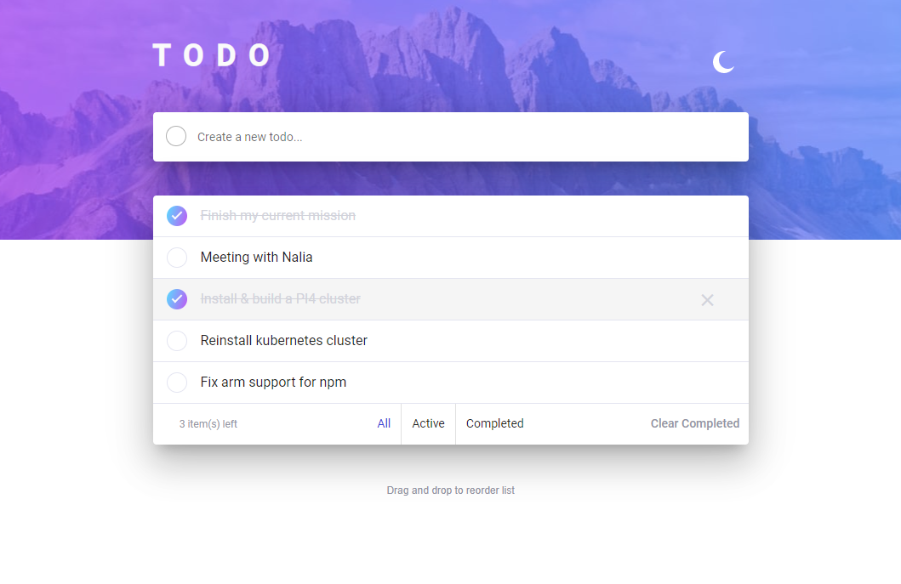

  

<h3 align="center">Simple todo</h3>

An Angular & Electron app

# Features

## Client Side

- [ ] Final design match ?
- [x] Add new todos to the list
- [x] Mark todos as complete
- [ ] Delete todos from the list
- [ ] Filter by all/active/complete todos
- [x] Clear all completed todos
- [x] See hover states for all interactive elements on the page
- [x] **Bonus**: Toggle light and dark mode
- [x] **Bonus**: Drag and drop to reorder items on the list

## Server Side

- [ ] Design a simple API for persisting state on the server side
- [ ] Implement routes for all listed **CRUD** operations
  - [ ] Create a news
  - [ ] Read all news
  - [ ] Update a news
  - [ ] Delete a news
  - [ ] Delete a news id list
- [ ] Implement swagger 3.0